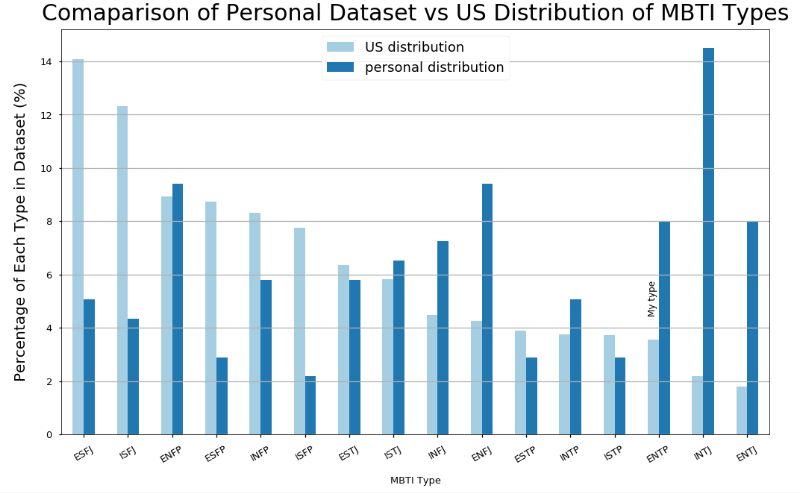
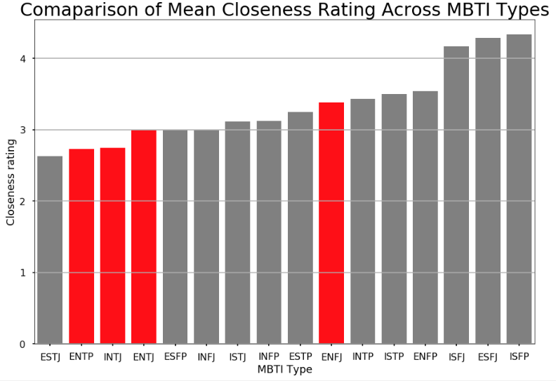
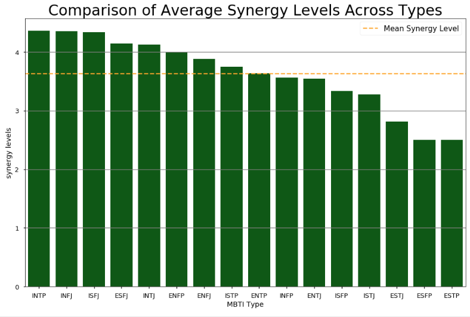

# Myers Briggs Testament Indicator Analysis (MBTI)

#### Author: Rico Holganza

## Rationale
Growing up, I have always been fascinated by trying to understand myself, people and the differences in our perceptions of the world. I learned about myself, the way I think, my cognitive functions and much more when I learned my MBTI type. This sparked a curiousity about other people and their individual and unique experience. Since 2011, I have been keeping track of people who know their MBTI type or those whom I requested to take the test. Some of my results are outlined below.

## Important Columns

**MBTI Type** : there are 16 possible 4-letter combinations. 

**Place Met** : location that I met this individual.

**Relationship**: what capacity I know/interact with the individual

**Closeness Rating** : 1-5 scale of my perception of how close we are. 1 = we know each other's names ; 5 = I trust this person with my life

**Synergy Level** : 1-5 scale of how well we work together to accomplish a goal. 1 = one or both of us are detrimental to each other's success; 5 = batman and robin, peanut butter & jelly, 2 peas-in-a-pod, Beyonce and Jay-Z. 

## Project Summary

### **The steps involved in execution of this project include:**

### **1. Data Import:** 

### **2. Data Preparation:** 

### 3. Data Exploration & Plotting

### 4. Hypothesis Testing

I tested the following Hypotheses:

**1** Due to the high percentage of INTJs, ENTJs, ENTPs and ENFJs in my dataset, I wanted to test if this was due being closer to these types.

**2** I have more synergy with Rationals (NTs) vs other types because this is my type

### Data Exploration & Plotting

**Insight 1:** My dataset follows a completely different distribution compared to the normal distribution of MBTI types in the US

**Insight 2:** There are at least twice as many INTJs, ENTJs, ENTPs, and ENFJs in my dataset than the normal distribution

### Hypothesis Testing

**Hypothesis 1:** Maybe I am closer to INTJs, ENTJs, ENTPs and ENFJs; therefore, I will have more of these types in my dataset.

**Insights:** Hypothesis 1 is false. ENTPs, INTJs and ENTJs are the among the least close types; therefore, the high frequency of these types are caused by another factor.

**Hypothesis 2:** I am an ENTP therefore I should have more synergy with Rationals (NTs) compared to all other types.

**Insights:** I have the most synergy with INTPs and INTJs are above the mean. However, ENTPs and ENTJs are at or below the mean. Therefore, the hypothesis is somewhat true.
